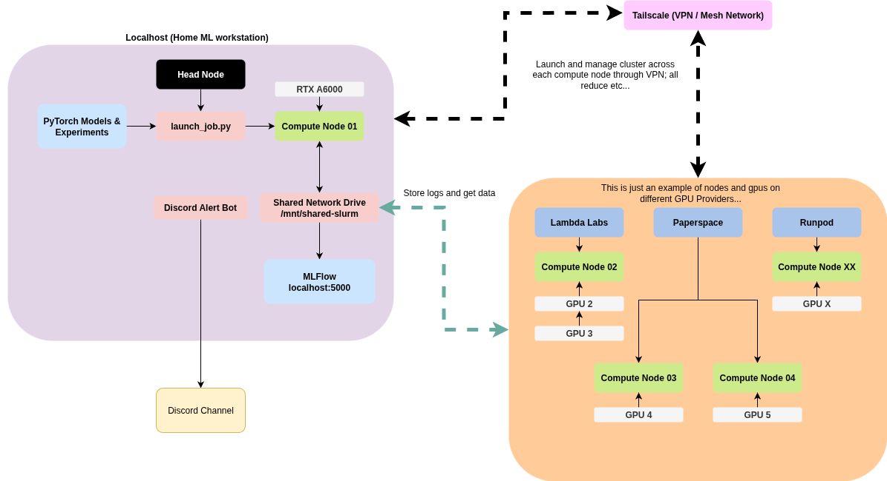

# cloud-slurm (WIP)
My personal Slurm cluster to orchestrate compute nodes across different GPU providers for multi-node multi-gpu model training; effectively creating a mesh network through Tailscale. This was written more-so for myself to keep track of all the steps.

Don't expect this to always be up to date but you might be able to use it as some sort of template for your own. You don't have to use the same GPU providers; so long as you can SSH into a VM instance and/or deploy a Docker container into them.



## Table of Contents
### Setup
1. [Prerequisites](#main-prerequisites)
2. [Tailscale Setup](#tailscale-setup)
   - [Generating an Auth Key](#generating-an-auth-key)
3. [Head Node Setup](#head-node-setup)
   - [Munge](#munge)
   - [Slurm](#slurm)
4. [Compute Node Setup](#compute-node-setup)
   - [Deploy to GPU Providers](#deploy-to-gpu-providers)
5. [Network Storage Setup](#network-storage-setup)
   - [Configurations](#configurations)

### Usage & Training
1. [Using Slurm](#using-slurm)
2. [Profiling](#profiling)
3. [Using PyTorch DDP with Slurm](#using-pytorch-ddp-with-slurm)
4. [Using MLFlow](#using-mlflow)
5. [Training On A Toy Example](#training-on-a-toy-example)

### Hardware
1. [Host Bus Adapters and SSDs](#host-bus-adapters-and-ssds)

## Main Prerequisites
1. [Tailscale](tailscale.com) -  Private VPN for your head and compute nodes to be within.
2. [Paperspace](paperspace.com)- Cloud GPU Provider
3. [Runpod](runpod.io) - Cloud GPU Provider
4. [Lambda Labs](lambda.ai) - Cloud GPU Provider
5. [MLFlow](https://mlflow.org/) - MLOps platform to track training progress.
6. [Docker](https://docs.docker.com/desktop/setup/install/linux/) - Containerization for our code.
7. [NCCL Operations](https://docs.nvidia.com/deeplearning/nccl/user-guide/docs/usage/operations.html) - Useful to know when dealing with DDP and FSDP


## Tailscale Setup
Register and subscribe to a [plan](https://tailscale.com/pricing) on Tailscale. Each of our nodes need to communicate with each other through some network and the easiest way to do this is to have them all connected to a single VPN with assigned static IP addresses. (More on this later)

### Generating an Auth Key
Once you've done that we'll have to generate an Auth key so that our nodes can connect into the VPN. 
Navigate through the web platform:

`Settings > Keys (Under Personal Settings) > Generate auth key...`

This part is entirely dependent on your security concerns when setting the expiration, ephemerality, and reusability. 

I do the following:
| Setting | State |
| ------- | ----- |
| Expiration | However long I feel that it would take to finish off my training job.|
| Ephemeral | Off. Since we are operating across the cloud and across different services our nodes may not be stable enough to maintain 24/7 uptime. Especially if you are using the Community Cloud in Runpod. |
| Reusable | On. I'm kind of lazy and although this is a big risk, having one key to set across all your nodes is convenient. Otherwise, you will have to maintain multiple Auth keys for your nodes if you want.|

One thing that sucks about  any of this is that when your Auth Key becomes invalid you will have to rotate through all your nodes and set them to a new one. There may be a way to automate this or do this a better way but this is the easiest solution I fell upon.

## Head Node Setup
I have my personal desktop as both a head and compute node with an **RTX A6000**. But you can extrapolate these instructions to just an exclusive head node either locally or on the cloud. I'd recommend using a cheap non-GPU instance for the head node if that is the case.

```
sudo apt update
sudo apt install -y slurm-wlm munge
```

### Tailscale
We'll install tailscale directly inside the node. Make sure to include the hostname parameter in the tailscale command. This will attach that hostname to the IP address assigned from tailscale and will remain persistent. Our ephemeral nodes (Nodes that restart), will always be assigned the same IP.
```
curl -fsSL https://tailscale.com/install.sh | sh
sudo tailscaled &
sudo tailscale up --authkey <TAILSCALE_AUTH_KEY> --hostname=<HOST_NODE_NAME>
tailscale ip
```

### Munge
We'll setup munge on here too and generate our key to be copied over later to our compute nodes.
```
sudo create-munge-key
sudo chown munge:munge /etc/munge/munge.key
su chmod 400 /etc/munge/munge.key
sudo systemctl enable --now munge
```

### Slurm
Run `lscpu` to get the following parameters: `Thread(s) per core`, `Core(s) per socket`, `Socket(s)`. Once you have these Slurm can automatically calculate the number of CPUs so you wouldn't need to specify the `CPUs` parameter in the `slurm.conf`.

To capture the amount of Free Memory run `free -m` and grab a rough total of what you think would be available.

Grab your tailscale ip address by running `tailscale ip`. If this is your local desktop like mines for my head node you can get away with `localhost`.

Grab your GPUs via `nvidia-smi -L`, if you have multiple ones you have to specify the number of GPUs `slurm.conf`.


To configure Slurm we'll have to create a conf file: `sudo touch /etc/slurm/slurm.conf`. Edit the file and copy the following template:

```
ClusterName=<NAME_OF_CLUSTER>
ControlMachine=<HEAD_NODE_HOSTNAME>
SlurmUser=slurm
SlurmctldPort=6817
SlurmdPort=6818
AuthType=auth/munge
StateSaveLocation=/var/spool/slurmctld
SlurmdSpoolDir=/var/spool/slurmd
SwitchType=switch/none
MpiDefault=none
TaskPlugin=task/none
ProctrackType=proctrack/pgid
GresTypes=gpu

# Specify all the nodes you plan on using that is connected to tailscale here with the following configurations.
# Copy this line for each node you have.
NodeName=<NODE_HOSTNAME> NodeHostName=<NODE_HOSTNAME> NodeAddr=<NODE_TAILSCALE_IP> Sockets=<NUM_SOCKETS> CoresPerSocket=<CORES_PER_SOCKET> ThreadsPerCore=<THREADS_PER_CORE> RealMemory=<MEM_SIZE> Gres=gpu:<NUM_GPUS> Feature=gpu State=UNKNOWN
...

PartitionName=main Nodes=ALL Default=YES MaxTime=INFINITE State=Up
```

The `PartionName` specifies the "group" that these nodes are a part of. It will help you separate specific work-loads for each of the nodes. So if you wanted some nodes to be part of one group or another you would identify them here. I'm just using the value `Nodes=ALL` since I care less about this. Otherwise you could do `Nodes=node[0-1]` if you have them numbered appropriately or specify the exact names like: `Nodes=node01,node02,node03`.

Now that we have our Slurm configured for our head node we can create the required directories and launch the daemon.
```
sudo mkdir -p /var/spool/slurmctld
sudo chown slurm: /var/spool/slurmctld
sudo systemctl enable --now slurmctld
```

**(OPTIONAL) Since this head node is also a compute node for myself I would also start `slurmd`**
```
sudo mkdir -p /var/spool/slurmd
sudo chown slurm: /var/spool/slurmd
sudo systemctl enable --now slurmd
```

As a sanity check run `scontrol show node` to see a list of nodes in your cluster and make sure everything is there.


## Compute Node Setup
Most of the configuration done for our compute nodes have already been setup from the previous section. So we'll mainly need to just copy some files over. We'll have to do these steps **FOR EACH** of our compute nodes.

Repeat the process for installing tailscale from the Head node in this node.

Install munge and copy the munge key that we created from our head node into these nodes. 
```
sudo apt install munge
scp <USER>@<HEAD_TAILSCALE_IP>:/etc/munge/munge.key <USER>@<COMPUTE_TAILSCALE_IP>:/etc/munge/munge.key
sudo chmod 400 /etc/munge/munge.key
sudo systemctl enable --now munge
```

Now copy the `slurm.conf` we created from the head node into here.
```
scp <USER>@<HEAD_TAILSCALE_IP>:/etc/slurm/slurm.conf <USER>@<COMPUTE_TAILSCALE_IP>:/etc/slurm/slurm.conf
```

You will have to configure `gres` to recognize and manage the GPU devices on each compute node.

Create a file called: `/etc/slurm/gres.conf` and configure it like so:
```
Name=gpu Type=default File=/dev/nvidia0
...
Name=gpu Type=default File=/dev/nvidiaN
```
**NOTE: If for whatever reason you find that your compute node can't detect the gpu; make sure that it has the correct permissions to access /dev/nvidiaX**
You can check by running the command `ls -l /dev/nvidia*`. If you see something like `root:root` or some other group then slurm may not be a part of them.
You can add a rule to `udev` to include slurm.

Run the following commands:
```
echo -e 'KERNEL=="nvidia[0-9]*", MODE="0666"\nKERNEL=="nvidiactl", MODE="0666"\nKERNEL=="nvidia-uvm", MODE="0666"\nKERNEL=="nvidia-modeset", MODE="0666"' | sudo tee /etc/udev/rules.d/99-slurm-nvidia.rules
sudo udevadm control --reload-rules
sudo udevadm trigger
```

To enable and launch our Slurm compute node we'll have to do the following again:
```
sudo apt install slurmd
sudo mkdir -p /var/spool/slurmd
sudo chown slurm: /var/spool/slurmd
sudo systemctl enable --now slurmd
```

### Deploy To GPU Providers

Use the `install-compute.sh` to set up the compute nodes. It follows the steps listed out above in the Compute section. I use the following providers: `Paperspace`, `Lambda Labs`, and `Runpod`.

## Network Storage Setup
I use a shared network drive, but you can also just copy your datasets over to each disk drive per compute node. There's pros and cons to each; if you need read speed and want to use
**LMDB** it may be worthwhile. However, I'll be using **WebDataset** for my shared network drive. My drive is located on the Head node which is my local desktop. It is a **4TB NVMe M.2 SSD**. The faster the read/write capabilities of the drive the better. You'll still have to consider network bandwidth for each node though!

### Setting up NFS
Install the NFS Server wherever you plan on hosting this drive. For my case, it will be my head node.

#### Head Node
```
sudo apt update
sudo apt install nfs-kernel-server
sudo mkdir -p /mnt/shared-slurm
sudo chown $USER:$USER /mnt/shared-slurm
```

Add all your tailscale node IPs to this file: `/etc/exports`. The lines should look like this. To display the current device's IP address run `tailscale ip`.
```
/mnt/shared-slurm <TAILSCALE_IP0>/10(rw,sync,no_subtree_check,no_root_squash)
...
/mnt/shared-slurm <TAILSCALE_IPN>/10(rw,sync,no_subtree_check,no_root_squash)
```

Then refresh and restart your `nfs-kernel-server`. If you don't have systemctl in a docker container you may have to use `supervisord`.
```
sudo exportfs -ra
sudo systemctl restart nfs-kernel-server
```

### Configurations
We'll also have to ensure that our `slurmctld` and `slurmd` services start after this is mounted. **Our NFS server will centralize all configurations across head/compute nodes to keep a single source of truth.**

```
sudo systemctl edit slurmctld
sudo systemctl edit slurmd
```

Add the line for both:
```
[Unit]
RequiresMountsFor=/mnt/shared-slurm
```

**NOTE: We'll have to do this for each Slurm compute node on `slurmd`**

#### Directory Structure
The following is the directory structured I've layed out in my `/mnt/shared-slurm` folder to centralize all configurations on datasets.

```
/mnt/shared-slurm/
- configs/
   - munge.key
   - slurm.conf
- datasets/
- mlruns/
- mlruns.db
```

Notice that we've moved the `munge.key` and `slurm.conf` files to the `/mnt/shared-slurm/configs/` folder. We're going to create symlink/copy each of these files in order to configure the services on all nodes. This is why its vital to maintain a mount order for the services.

#### Compute Node
```
sudo apt update
sudo apt install nfs-common
sudo mkdir -p /mnt/shared-slurm
sudo mount <TAILSCALE_SHARED_DRIVE_IP>:/mnt/shared-slurm /mnt/shared-slurm
```

To set up auto-mount on reboot modify the `/etc/fstab` per node and add the following line.
```
<TAILSCALE_SHARED_DRIVE_IP>:/mnt/shared-slurm /mnt/shared-slurm nfs defaults 0 0
sudo mount -a
```

## Using Slurm
Some useful commands to keep on the back of your hand to use and debug the cluster.

### Slurm Commands
```
scontrol show nodes
squeue 
sbatch 
srun
scancel <job_id> # Cancel a job in the queue.
sinfo -Nl # See the status of your nodes.
scontrol update NodeName=<NODENAME> State=RESUME # If you want to resume a node when its in the down state.

sudo journalctl -u slurmd # Check daemon logs.
sudo less /var/log/slurmd.log
```

Creating a slurm job:
```
```

## Profiling
I'm not going to go too in-depth into this because it starts to depart from the scope of this repository. But a few quick things you can do to check performance...

```
kernprof
line_profiler
nvidia-nsight
htop
gpustat
pdsh
```

## Using MLFlow
We'll need to setup our tracking server on the head now; at least that's where I would want it. This will centralize all metrics coming from our different compute nodes here.

Make sure to store the artifacts on the shared network drive.
```
export MLFLOW_TRACKING_URI=<TAILSCALE_HEAD_NODE_IP>
--host 0.0.0.0 \
--port 5000 \
--backend-store-uri sqlite://mlruns.db \
--default-artifact-root /mnt/shared-slurm/mlruns
```

That's pretty much it, just make sure port `5000` is exposed in Tailscale to the rest of your nodes. See example python code on how I track my training jobs.

If you want to have this automatically start up you can create a systemd service called: `/etc/systemd/system/mlflow.service`
```
[Unit]
Description=Slurm MLFlow 
After=network.target

[Service]
User=<USER_ID>
ExecStart=<PATH_TO_START_MLFLOW_SH>
WorkingDirectory=/mnt/shared-slurm
Restart=always
RestartSec=5

[Install]
WantedBy=multi-user.target
```

Then just enable and start it. Sanity check it via `journalctl -u mlflow -f`.
```
sudo systemctl daemon-reload
sudo systemctl enable mlflow
sudo systemctl start mlflow
```

## Using PyTorch DDP & FSDP with Slurm
This is fairly straight forward. Slurm and PyTorch does a lot of the work for setting up some variables such as `WORLD_SIZE`, `LOCAL_RANK`, and `RANK` to martial out the nodes and gpus when we use our `torchrun` command so it's fairly seamless.

### DDP (Distributed Data Parallel)
Conceptually simple, DDP essentially copies the model weights and optimizer states across all your ranks (gpus) and runs forward/backward pass on each of the ranks separately using a **different batch of data** per rank. Once all calculations are finished on each rank, an `all-reduce` operation is performed to gather up the gradients and update all the models in each of the ranks; then repeat. This ultimately increases the bandwidth of how much data you can process but is memory inefficient.

... Include func calls

### FSDP (Fully Sharded Data Parallel)


## Training On A Toy Example
Navigate to the `train-toy` directory.

Create a conda environment:
```
conda create -n slurm-toy
conda activate slurm-toy

```

# Hardware
These are just random notes about how I have my workstation set up. Entirely unique to what types of equipment I have laying around.

## Host Bus Adapters and SSDs
I have 16+ 2.5 SSDs laying around and I want to make use of them to store a bunch of ML datasets. One thing I was trying to minimize here was Read/Write throughput which is why I opted to directly connect these SSDs to my workstation via SATA. I could have done a NAS setup but I think this setup is faster. This will be connected to my head node.

| Equipment | Amount |
|-----------------|-----------------|
| [LSI Broadcom SAS 9300-8i 8-port 12 GB/s SATA+SAS PCI-Express 3.0 Host Bus Adapters](https://www.amazon.com/dp/B00DSURZYS) | 2 |
| [Internal Mini SAS HD to SATA Cable 3.3 Feet, 1m (SFF-8643 to SATA Forward Breakout)](https://www.amazon.com/dp/B01BW1U2L2?ref=ppx_yo2ov_dt_b_fed_asin_title)| 4 |
| [PRIME Z790-P WIFI](https://www.amazon.com/ASUS-Z790-P-Motherboard-Bluetooth-ThunderboltTM/dp/B0BG6LGNDB?th=1) | 1 |


So the Host Bus Adapter will allow us to connect more SSDs than what is available with the pre-existing motherboard. Each of them have 2 Mini-SAS outputs that we can breakout into 4 SATA inputs each. Henceforth, each Host Bus Adapter supports 8 SSDs, with 2 of them we get a total of 16 SSDs to wire together.

With my current motherboard I can only support 2 HBAs.